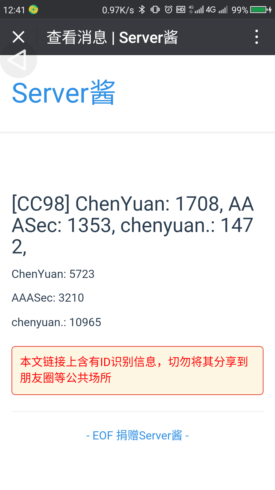

# daily_notification

适合于 ZJUer 的日常通知，使用方糖气球的 [Server酱](http://sc.ftqq.com/) 作为通知服务, 结合定时任务可以实现每天自动 CC98 签到，寝室电费、校园卡消费推送等功能

## 如何使用

运行本项目需要自行配置一些 `conf` 文件，参见 [conf_example](conf_example/)

首先你需要在[Server酱](http://sc.ftqq.com/)上获取一个`SCKEY` ， 使用 Github 账号 Oauth 登录，绑定你的微信，将获取的 SCKEY 写入到`conf/sc.py`中

目前完成的模块： 

### [CC98 自动签到模块](cc98autocheckin_module.py)

需要配置`conf/cc98.py`：将你的 CC98 Cookie 中 aspsky 的值作为 cookies 数组的一员，写入到 `conf/cc98.py` 后即可运行 `cc98autocheckin_module.py` 啦

预期效果: 签到后推送本次签到获得的 CC98 米和目前拥有的 CC98 米

### [电表查询模块](electricitybill_module.py)

需要配置`conf/zuinfo.py`，写入你的学号 `xh` 和 统一通行证密码 `password`

预期效果：推送距离上次查询花费的电费，以及预估每天电费

### [NHD 自动签到模块](nhdautocheckin_module.py)

需要配置`conf/nhd.py`，写入你的 Cookie，注意页面设置应该为英文版

预期效果：自动签到，推送当前魔力值，和获取魔力值的速度

----

## 目录结构

base.py : DailyNotification_Base 父类，子类需要重载其 work 方法

notification.py: 调用 Server酱 进行信息推送

EasyLogin.py: 对 requests 和 BeautifulSoup 进一步封装的爬虫模块. 求个 Star [https://github.com/zjuchenyuan/EasyLogin](https://github.com/zjuchenyuan/EasyLogin)

cc98autocheckin_module.py: CC98 自动签到模块，可以直接运行，将对配置的所有账号进行签到
